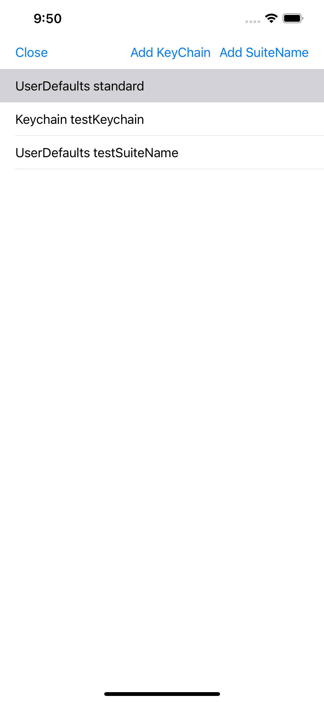
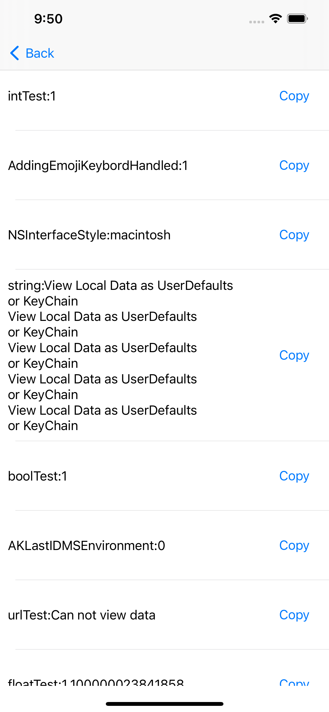

# LocalDataViewer
### View Local Data as UserDefaults or KeyChain




# Install

```
pod 'LocalDataViewer'
```

# Use
```
let vc = LocalDataViewer.getMenuVC()
present(vc, animated: true, completion: nil)
```

# Demo App
https://github.com/manhpham90vn/iOS-VIPER-Architecture
